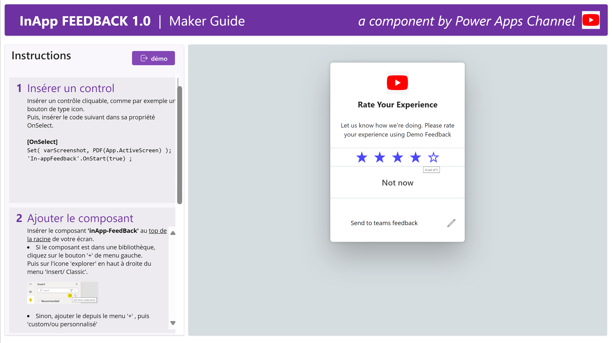
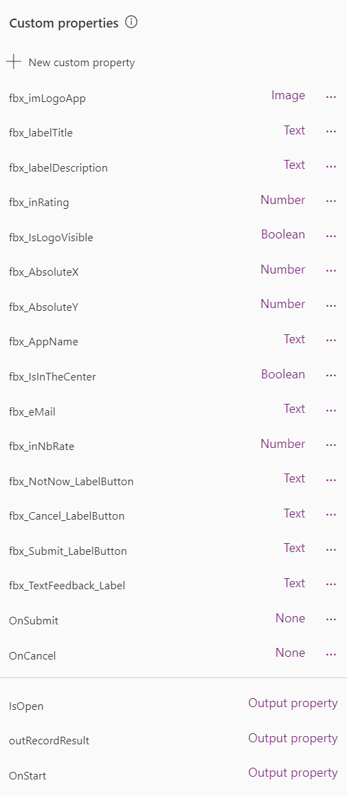
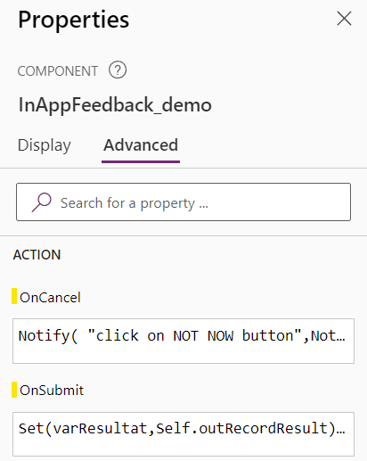
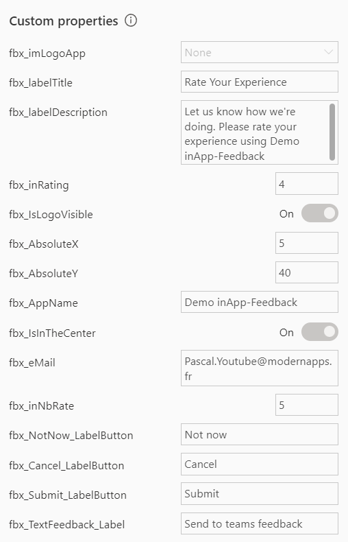

# InApp-Feedback

This component will allow you to add Feeback User into your Apps

## Disclaimer
This component is provided to you as is and without support.
It can be used on an experimental basis.
You are not allowed to resell it, but you can use it in all your Apps and those of your customers without limit.

## Instructions
**Instructions** Page

**Demo** Page - When **IsOpen** = false

.png)

## **InApp-Feedback** component properties
Here are the properties available to configure the InApp-Feedback component:

### Input
- **fbx_IsLogoVisible**    (boolean)   = Display your Logo
- **fbx_imLogoApp**        (image)     = Image of your Logo
- **fbx_labelTitre**       (text)      = Principal label
- **fbx_labelDescription** (text)      = Second label bloc
- **fbx_inNbRate**         (number)    = Rating scale, up to 15
- **fbx_inRating**         (number)    = Default rating value
- **fbx_NotNow_LabelButton** (text) = label of btNotNow button
- **fbx_Cancel_LabelButton** (text) = label of btCancel button
- **fbx_Submit_LabelButton** (text) = label of btSubmit
- **fbx_TextFeedback_Label** (text) = label of comment bloc
- **fbx_IsInTheCenter** (boolean) = Is the Feedback in the center
- **fbx_AbsoluteX** (number) = X Axis in 'absolute' position.  /!\ when fbx_IsInTheCenter is 'false'
- **fbx_AbsoluteY** (number) = Y Axis in 'absolute' position
- **fbx_AppName** (text) = Name of your App

### Events (Action)
- **OnSubmit** = triggered when
- **OnCancel** = triggered 

- 

## Output
- **IsOpen** (boolean) =
- **outRecordResut** (record)  =
  - **title** (texte) =
  - **fbxAppID** (texte) =
  - **fbxAppName** (texte) =
  - **fbxNotation** (number) =
  - **fbxComment** (texte) =
  - **fbxOtherInfos** (texte) =
- **OnStart** (boolean) with properties =

User example

**Demo** Page - When **IsOpen** = true

.png)

## How To install it ?
### Import this Apps

0. Download https://github.com/pcasti/PowerApps/blob/main/Components/inApp-Feedback/InApp-Feeback_APPS_to_import_20241208.zip
1. Go to https://make.powerapps.com 
2. from the Power Apps screen, Click on **Applications** in the left menu
3. Click the **Import canvas app** button
4. Select the downloaded app using the **Upload** button
5. Click the **Import** button
6. Wait for the import to finish
7. Verify in the Apps List

## Video
Video tutorial:
https://youtu.be/D1NLv_Ed20U?si=adNqXM_alGgdshEb 

